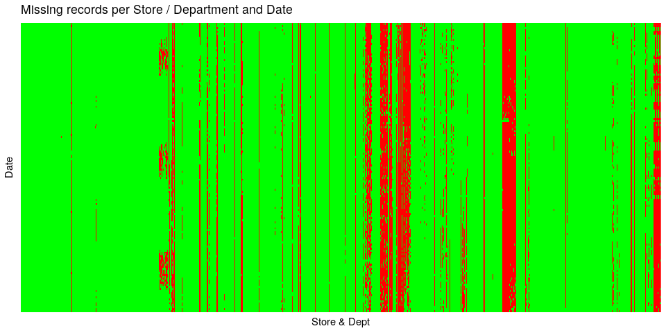

Forecasting Sales of Walmart Department Stores
============================================

Introduction
============

In this challenge we need to model retail data. More specifically, we
have to project sales for every department of 45 Walmart stores, located
in different regions.

Exploratory Analysis and Feature Engineering
============================================

First look
----------

Let’s load the dataset:

``` r
require(dplyr)
require(ggplot2)
library(ggcorrplot)
require(gridExtra)
require(VIM)
require(tseries)
require(pbapply)
require(doParallel)

require(prophet)
require(forecast)
```

``` r
store <- read.csv("stores.csv") 
feats <- read.csv("features.csv")

train.set <- read.csv("train.csv")
test.set <- read.csv("test.csv")

# Merge train/test set
dset <- bind_rows(train.set, test.set) %>%
  mutate(Date = as.Date(Date, "%Y-%m-%d")) # Convert to date format

summary(dset)
```

    ##      Store            Dept            Date             Weekly_Sales   
    ##  Min.   : 1.00   Min.   : 1.00   Min.   :2010-02-05   Min.   : -4989  
    ##  1st Qu.:11.00   1st Qu.:18.00   1st Qu.:2010-12-17   1st Qu.:  2080  
    ##  Median :22.00   Median :37.00   Median :2011-11-04   Median :  7612  
    ##  Mean   :22.21   Mean   :44.28   Mean   :2011-11-01   Mean   : 15981  
    ##  3rd Qu.:33.00   3rd Qu.:74.00   3rd Qu.:2012-09-14   3rd Qu.: 20206  
    ##  Max.   :45.00   Max.   :99.00   Max.   :2013-07-26   Max.   :693099  
    ##                                                       NA's   :115064  
    ##  IsHoliday      
    ##  Mode :logical  
    ##  FALSE:498045   
    ##  TRUE :38589    
    ##                 
    ##                 
    ##                 
    ## 

``` r
summary(store)
```

    ##      Store    Type        Size       
    ##  Min.   : 1   A:22   Min.   : 34875  
    ##  1st Qu.:12   B:17   1st Qu.: 70713  
    ##  Median :23   C: 6   Median :126512  
    ##  Mean   :23          Mean   :130288  
    ##  3rd Qu.:34          3rd Qu.:202307  
    ##  Max.   :45          Max.   :219622

``` r
summary(feats)
```

    ##      Store            Date       Temperature       Fuel_Price   
    ##  Min.   : 1   2010-02-05:  45   Min.   : -7.29   Min.   :2.472  
    ##  1st Qu.:12   2010-02-12:  45   1st Qu.: 45.90   1st Qu.:3.041  
    ##  Median :23   2010-02-19:  45   Median : 60.71   Median :3.513  
    ##  Mean   :23   2010-02-26:  45   Mean   : 59.36   Mean   :3.406  
    ##  3rd Qu.:34   2010-03-05:  45   3rd Qu.: 73.88   3rd Qu.:3.743  
    ##  Max.   :45   2010-03-12:  45   Max.   :101.95   Max.   :4.468  
    ##               (Other)   :7920                                   
    ##    MarkDown1        MarkDown2           MarkDown3           MarkDown4       
    ##  Min.   : -2781   Min.   :  -265.76   Min.   :  -179.26   Min.   :    0.22  
    ##  1st Qu.:  1578   1st Qu.:    68.88   1st Qu.:     6.60   1st Qu.:  304.69  
    ##  Median :  4744   Median :   364.57   Median :    36.26   Median : 1176.42  
    ##  Mean   :  7032   Mean   :  3384.18   Mean   :  1760.10   Mean   : 3292.94  
    ##  3rd Qu.:  8923   3rd Qu.:  2153.35   3rd Qu.:   163.15   3rd Qu.: 3310.01  
    ##  Max.   :103185   Max.   :104519.54   Max.   :149483.31   Max.   :67474.85  
    ##  NA's   :4158     NA's   :5269        NA's   :4577        NA's   :4726      
    ##    MarkDown5             CPI         Unemployment    IsHoliday      
    ##  Min.   :  -185.2   Min.   :126.1   Min.   : 3.684   Mode :logical  
    ##  1st Qu.:  1440.8   1st Qu.:132.4   1st Qu.: 6.634   FALSE:7605     
    ##  Median :  2727.1   Median :182.8   Median : 7.806   TRUE :585      
    ##  Mean   :  4132.2   Mean   :172.5   Mean   : 7.827                  
    ##  3rd Qu.:  4832.6   3rd Qu.:213.9   3rd Qu.: 8.567                  
    ##  Max.   :771448.1   Max.   :229.0   Max.   :14.313                  
    ##  NA's   :4140       NA's   :585     NA's   :585

It appears that the time span our data covers is roughly 3.5 years and
from those, we need to forecast the next 6 months. Interestingly enough,
there are some *negative* sales in the training set, as well as
markdowns. This might be an error, or product returns. We should flag
them with a new column (we’ll name it returns). At the same time, let’s
see how many different store-departments we have:

``` r
dset <- dset %>%
  mutate(Returns = ifelse(Weekly_Sales < 0, Weekly_Sales, 0))

print(paste("Total no. of store-department combinations:", dset %>%
  mutate(StoreDept = interaction(Store, Dept)) %>%
  select(StoreDept) %>%
  unique() %>%
  summarise(n())))
```

    ## [1] "Total no. of store-department combinations: 3342"

More than 3000 time-series to model. It is going to be a lot of work to
make different models for each. Let’s see what time span our training
set covers:

``` r
# Get the date up to which the data belongs to the training set
last.train.date <- train.set %>%  
  mutate(Date = as.Date(Date, "%Y-%m-%d")) %>% # Convert to date format
  arrange(Date) %>%
  summarize(last(Date))

last.train.date <- as.Date(last.train.date$`last(Date)`)

train.set.dur <- difftime(last.train.date, dset[1, "Date"], units = "weeks")

print(paste("First date on the training set:", dset[1, "Date"]))
```

    ## [1] "First date on the training set: 2010-02-05"

``` r
print(paste("Last date on the training set:", last.train.date))
```

    ## [1] "Last date on the training set: 2012-10-26"

``` r
print(paste("No. of weeks in total:", train.set.dur))
```

    ## [1] "No. of weeks in total: 142"

So, we have in total 142 weeks in the training set, with 3342 different
departments. This should amount to 3342\*142 = 474564 observations.
However, the training set contains only 421570. We are 52994
observations short.

Ok, let’s merge the different tables together to make the whole analysis
easier, and then we’ll investigate the missing values a bit more.

``` r
dset <- merge(dset, feats, all.x = T) %>%
  merge(., store, all.x = T) %>%
  mutate(Returns = ifelse(Weekly_Sales < 0, T, F))
```

Missing data
------------

Let’s begin with a heatmap-like plot to visualize the missing values
over time per department:

``` r
# Function to isolate observations from the training set only
get.train <- function(df = dset, last_date = last.train.date)
{
  df %>% filter(Date <= last.train.date)
}

# Function to isolate observations from the test set only
get.test <- function(df = dset, last_date = last.train.date)
{
  df %>% filter(Date > last.train.date)
}

sales.mtrx <- get.train() %>%
  mutate(StoreDept = interaction(Store, Dept)) %>%  # Merge store - department
  select(StoreDept, Date, Weekly_Sales) %>%
  reshape(., idvar = "StoreDept", timevar = "Date", direction = "wide") %>%
  data.frame %>%
  reshape2::melt(., id.vars="StoreDept")  # Revert back to long format (with the newly added NaN values)

sales.mtrx %>%
  mutate(value = as.logical(ifelse(is.na(value), 1, 0))) %>%
  ggplot(aes(x = StoreDept, y = variable, fill =  value)) + 
  geom_tile() + 
  scale_fill_manual(values = c("green", "red")) + 
  theme(axis.text.x = element_blank(),
        axis.ticks.x = element_blank(),
        axis.ticks.y = element_blank(),
        axis.text.y = element_blank(),
        legend.position = "none") + 
  ggtitle('Missing records per Store / Department and Date') + 
  xlab('Store & Dept') + ylab('Date')
```



There are no visible patterns when it comes to missing data over dates
(horizontally), however it is pretty clear that there are a lot of
missing records for specific departments (vertically). Let’s have a look
at the number of missing records per store-department combination, once
again in a heatmap-like plot:

``` r
max_count <- 142 # No weeks in the training dataset

get.train() %>%
  select(Store, Dept, Weekly_Sales) %>%
  group_by(Store, Dept) %>%
  summarize(missing = (1 - n() / max_count) * 100) %>%
  ggplot(aes(x = Dept, y = Store, fill = missing)) + geom_tile() + 
  scale_fill_gradient(low = "green", high = "red") + 
  theme(axis.text.x = element_text(size = 6, angle = 90),
        axis.text.y = element_text(size = 6, angle = 0)) + 
  ggtitle('Missing records per Store / Department')
```


There are a few patterns here. On the Dept level we have several
departments with mostly missing values. Departments 36, 39 and 77 for
example. At the same time, several stores seem to have an alarming
number of missing records (stores 33 and 36 as an example).

We could perform imputation for each department if it has somewhere
between 10% - 20% missing data (20% is rather over the safety limit). If
we use regression-based imputation we might be able to get away with a
higher number of missing records, at the expense of greater risk though.
We’ll filter out the store/department combinations with more than 20%
missing data, and the rest we’ll impute.

For the departments we’re dropping, to forecast at a certain point in
time, if the data is there, we can just predict the same sales 52 weeks
in advance (i.e. same sales as last year), otherwise we’ll predict zero
sales, or the median of all the other stores of the same type, or
something like that - we’ll deal with this later. Ideally we would
impute every time-series ‘carefully’, i.e. checking the distribution of
values, seasonality, comparing trends with other ‘similar’ stores
(whatever similar means in this case), but this is not time-effective
when we have to many time-series to work with. We need a bulk, and by
extension crude, approach.

For now, let’s filter out the departments with more than 30% missing
data, and we’ll treat them differently later on:

``` r
# Make a list with store-dept combos missing more than 30% records
missing_data <- get.train() %>%
  select(Store, Dept, Weekly_Sales) %>%
  group_by(Store, Dept) %>%
  summarize(missing = (1 - n() / max_count) * 100) %>%
  ungroup %>%
  filter(missing >= 30) %>%
  select(-missing)

# Keep them in a separate dataframe
train.set.missing <- inner_join(get.train(), missing_data, by = c("Store", "Dept")) %>%
  select(Store, Dept, Date, IsHoliday, Weekly_Sales)

test.set.missing <- inner_join(get.test(), missing_data, by = c("Store", "Dept")) %>%
  select(Store, Dept, Date, IsHoliday, Weekly_Sales)

# Update the training/test set 
new.train.set <- anti_join(get.train(), missing_data, by = c("Store", "Dept"))
new.test.set <- anti_join(get.test(), missing_data, by = c("Store", "Dept"))

# Merge them into new datasets
dset <- bind_rows(new.train.set, new.test.set)
dset.missing <- bind_rows(train.set.missing , test.set.missing)
```

Sales
-----

Let’s start with sales.

``` r
get.train() %>%
  mutate(StoreDept = interaction(Store, Dept)) %>%
  select(Date, StoreDept, Weekly_Sales ) %>%
  reshape2::melt(id.vars = c("Date", "StoreDept")) %>%
  ggplot((aes(x = Date, y = value, group = StoreDept))) + 
  geom_line() + 
  ggtitle('Weekly Sales')
```


Big spikes are occuring near the end of each year. The must be
similarities between the different time-series. We should attempt to
cluster them later on. Let’s make a heatmap-like plot, to visualize
histograms over time. This will give us an idea on what values are more
common and how they trend over time:

``` r
# Make breakpoints
breaks <- seq(min(dset$Weekly_Sales, na.rm = T),
              max(dset$Weekly_Sales, na.rm = T),
              length.out = 80)

# plot
get.train() %>%
  mutate(Interval = findInterval(.$Weekly_Sales, breaks)) %>%
  select(Date, Interval) %>%
  group_by(Date, Interval) %>%
  summarise(counts = n()) %>%
  ungroup %>% data.frame %>%
  ggplot(aes(x = Date, y = Interval, fill = counts)) + geom_tile() +
  scale_fill_gradient2(low = "yellow", mid = "blue", high = "red", na.value = "grey50", trans = "log10") + 
  ggtitle("Sales histogram over time")
```


Sales seem to be highly skewed. Most of the observations belong to the
first 5-10 intervals, that is (from the breakpoints) below 50,000. There
are also some very high sales near the end of each year, which is
understandable (everyone goes out shopping during Christmas).

Store-related Data
------------------

In the store-related data we might have some features that could be used
for the prediction of the weekly sales. First of all, let’s see how many
unique values we have on the store features:

``` r
print(paste("Unique CPI values: ", length(unique(dset$CPI))))
```

    ## [1] "Unique CPI values:  2506"

``` r
print(paste("Unique unemployment rate values: ", length(unique(dset$Unemployment))))
```

    ## [1] "Unique unemployment rate values:  405"

``` r
print(paste("Unique Temperature values: ", length(unique(dset$Temperature))))
```

    ## [1] "Unique Temperature values:  4178"

``` r
print(paste("Unique Fuel price values: ", length(unique(dset$Fuel_Price))))
```

    ## [1] "Unique Fuel price values:  1011"

Let’s convert the rest of the appropriate variables to factors, convert
the dates to the appropriate date format, and to help us later on, let’s
take each week, month and year on different columns:

``` r
dset <- dset %>%
  mutate(Date = as.Date(Date, "%Y-%m-%d")) %>% # Convert to date format
  mutate_at(vars(Store, Dept, IsHoliday), funs(as.factor)) %>% # Factors
  mutate(Year = as.factor(format(Date, "%Y"))) %>% # Make year
  mutate(Month = as.factor(format(Date, "%m"))) %>% # Make month
  mutate(Week = as.factor(format(Date, "%V"))) # Make week
```

Let’s start by having a closer look at Wallmart’s stores. More
specifically, type of store and size:

``` r
p1 <- store %>%
  ggplot(aes(Type, fill = Type)) + geom_bar() + 
  ggtitle("Store type counts") +
  theme(legend.position = "none")

p2 <- store %>%
  ggplot(aes(x = Type, y = Size, fill = Type)) + geom_boxplot() + 
  geom_jitter(position = position_jitter(0.2)) + 
  ggtitle("Size distribution per store type") +
  theme(legend.position = "none")

grid.arrange(p1, p2, ncol = 2)
```


There’s an imbalance in the store types. Out of the 45 stores, only 6
are of type C. Also there’s certainly a correlation between store size
and type, except from a few ‘odd’ occurences for sizes below 50000.
Let’s convert all stores with a small size (below 50000) to type C:

``` r
dset <- dset %>%
  mutate(Type = as.character(Type)) %>%
  mutate(Type = ifelse(Size <= 50000, "C", Type)) %>%
  mutate(Type = as.factor(Type))
```

### Effect of Store Type and Size on Sales

I would expect that larger stores - reflected both by their type and
Size variables - will have increased sales, throughout the year. Let’s
have a look:

``` r
get.train() %>%
  select(Date, Type, Weekly_Sales) %>%
  group_by(Date, Type) %>%
  summarize(Mean_Sales = mean(Weekly_Sales),
            SD_Sales = sd(Weekly_Sales)) %>%
  ungroup %>%
  ggplot((aes(x = Date, group = Type))) + 
  geom_line(aes(y = Mean_Sales, color = Type)) + 
  geom_ribbon(aes(ymax = Mean_Sales + SD_Sales, 
                  ymin = Mean_Sales - SD_Sales,
                  fill = Type),
              alpha = 0.2,
              colour = NA )+
  ggtitle('Mean Weekly Sales per Store Type')
```


Overall, type does seem to have an effect on sales, but the variance is
way too high…

Let’s take a closer look at size:

``` r
get.train() %>%
  ggplot(aes(x = Size, y = Weekly_Sales)) + 
  geom_point(alpha = 0.1) +
  geom_smooth(method = 'lm') + 
  scale_y_log10() +
  facet_wrap(.~ Type, scales = 'free') +
  ggtitle('Weekly sales vs. store size')
```


The tendency for higher sales with higher store size does exist for
store types A and B, and the opposite is true for store type C (?!).
But, once again, the variance is too high to make a safe conclusion.

Size seems to have certain fixed values for all types:

``` r
print(paste("No. unique size values for store type A:", nrow(unique(dset %>% filter(Type == 'A') %>% select(Size)))))
```

    ## [1] "No. unique size values for store type A: 19"

``` r
print(paste("No. unique size values for store type B:", nrow(unique(dset %>% filter(Type == 'B') %>% select(Size)))))
```

    ## [1] "No. unique size values for store type B: 15"

``` r
print(paste("No. unique size values for store type C:", nrow(unique(dset %>% filter(Type == 'C') %>% select(Size)))))
```

    ## [1] "No. unique size values for store type C: 6"

Indeed. Given that store size values between different store types do
not overlap (from the previous plots), we have 40 different store sizes.
An interesting question now is, can we normalize sales with respect to
store size? At first, let’s plot the time-series of median sales per
store size:

``` r
get.train() %>%
  select(Date, Size, Weekly_Sales) %>%
  group_by(Date, Size) %>%
  summarize(Median_Sales = median(Weekly_Sales)) %>%
  ungroup %>%
  ggplot((aes(x = Date, group = Size))) + 
  geom_line(aes(y = Median_Sales, color = Size)) +
  ggtitle('Median Weekly Sales per Store Size')
```


Tthis is not the best visualization ever made, but it does indicate that
there is a tendency towards higher sales with higher store size. Let’s
divide the two and see how that looks:

``` r
dset <- dset %>%
  mutate(Weekly_Sales_Size = Weekly_Sales / Size)

get.train() %>% 
  mutate(StoreDept = interaction(Store, Dept)) %>%
  select(StoreDept, Date, Size, Type, Weekly_Sales_Size) %>%
  reshape2::melt(id.vars = c("Date", "StoreDept", "Size", "Type")) %>%
  ggplot((aes(x = Date, y = value, group = StoreDept))) + 
  geom_line(aes(color = Size)) +
  facet_wrap(.~ Type, nrow = 3, scales = "free") + 
  ggtitle('Weekly Sales / Store Size') + 
  ylab("Weekly Sales / Store Size")
```


Indeed, this is somewhat clearer. The most interesting part is the
difference in the behavior for each type. For stores with big size
(mostly of type A), the spikes near the end of the year are not so
prominent as for type B stores. The smallest stores (the type C ones)
exhibit a more erratic behavior without any prominent spikes. We could
treat each store type in a different pipeline for the prediction.

CPI, Unemployment Rate, Temperature and Fuel Price
--------------------------------------------------

CPI and unemployment rate should have an effect on sales, for obvious
reasons. Whether or not that effect is significant (and to what extent),
is something we need to check. First of all, let’s have a look at the
distribution of the values:

``` r
dset %>%
  select(Store, CPI, Unemployment, Temperature, Fuel_Price) %>%
  reshape2::melt(., id.vars = "Store") %>%
  ggplot(aes(x = Store, y = value, group = Store)) + 
  geom_boxplot() + 
  theme(axis.text.x = element_text(angle = 90, hjust = 1)) +
  xlab('Store No.') + 
  facet_wrap(.~variable, scales = 'free', ncol = 1) + 
  ggtitle("Distributions of CPI, Unemployment, Fuel Price and Temperature per store for the entire time span")
```


Consumer price index can be split in two categories (high and low) at a
value of around 165. Unemployment presents higher variance among
different stores, with some relatively high values for stores 12, 28 and
38. On the other hand, temperature and fuel price seem to be more or
less the same across stores..

Let’s see how they correlate with sales:

``` r
get.train() %>% 
  select(Weekly_Sales_Size, CPI, Unemployment, Temperature, Fuel_Price, Size) %>%
  cor(method = "spearman") %>%
  ggcorrplot(., 
             hc.order = TRUE,
             type = "lower",
             outline.color = "white",
            lab = T) + 
  ggtitle("Spearman correlation of store features and sales")
```


This does confirm our previous observations. There is a weak monotonic
relation between sales and store size, but the rest of the features do
not hold any predictive value. We can safely ignore them:

``` r
dset <- dset %>%
  select(-c(Fuel_Price, Temperature, CPI, Unemployment))
```

Markdowns
---------

At first, we should have a look on how many missing values the markdowns
have. Let’s make an aggregation plot:

``` r
aggr(get.train() %>% select(starts_with("MarkDown")), oma = c(10, 5, 5, 3))
title('Missing Data - Markdowns')
```


More than half the values are missing. What is more interesting though
is that they are missing together most of the time. The missing values
might mean that there are no markdowns running on a given week. If that
is the case, we could set them to zero. Let’s have a look at the
distributions of the markdowns:

``` r
get.train() %>%
  select(starts_with("MarkDown")) %>%
  reshape2::melt() %>%
  ggplot(aes(x = variable, y = value, fill = variable)) + 
  geom_boxplot() +
  ggtitle('Markdown distributions') + 
  theme(legend.position = "none")
```


The markdowns are highly skewed. A log-transform will help if we decide
to use them in the end, but we first have to figure out what to do with
the missing values. Let’s see if there are any negative values:

``` r
get.train() %>%
  select(starts_with("MarkDown")) %>%
  na.omit %>%
  summarize_each(funs(min))
```

    ## Warning: `summarise_each_()` is deprecated as of dplyr 0.7.0.
    ## Please use `across()` instead.
    ## This warning is displayed once every 8 hours.
    ## Call `lifecycle::last_warnings()` to see where this warning was generated.

    ##   MarkDown1 MarkDown2 MarkDown3 MarkDown4 MarkDown5
    ## 1      32.5   -265.76     -29.1      0.46    170.64

Markdowns 2 and 3 get negative values. We will perform a log-transform
while adding the minimum value (+0.001) for each, and also include new
binary variables indicating if the corresponding markdowns are present:

``` r
dset <- dset %>%
  mutate(MD1 = ifelse(is.na(MarkDown1), 0, 1), # Add binary variables
         MD2 = ifelse(is.na(MarkDown2), 0, 1),
         MD3 = ifelse(is.na(MarkDown3), 0, 1),
         MD4 = ifelse(is.na(MarkDown4), 0, 1),
         MD5 = ifelse(is.na(MarkDown5), 0, 1),
         MarkDown1 = ifelse(MD1 == 1, log10(MarkDown1 + abs(min(MarkDown1, na.rm = T)) + 0.001), 0), # log-transform
         MarkDown2 = ifelse(MD2 == 1, log10(MarkDown2 + abs(min(MarkDown2, na.rm = T)) + 0.001), 0),
         MarkDown3 = ifelse(MD3 == 1, log10(MarkDown3 + abs(min(MarkDown3, na.rm = T)) + 0.001), 0),
         MarkDown4 = ifelse(MD4 == 1, log10(MarkDown4 + abs(min(MarkDown4, na.rm = T)) + 0.001), 0),
         MarkDown5 = ifelse(MD5 == 1, log10(MarkDown5 + abs(min(MarkDown5, na.rm = T)) + 0.001), 0))
```

Let’s see how they correlate with sales, and with each other:

``` r
get.train() %>% 
  select(c(starts_with("MarkDown"), Weekly_Sales_Size)) %>%
  cor(method = "spearman") %>%
  ggcorrplot(., 
             hc.order = TRUE,
             type = "lower",
             outline.color = "white",
            lab = T) + 
  ggtitle("Spearman correlation of markdowns and sales")
```


They are all highly related to each other, but none of them seem to have
a significant effect on sales. Let’s see if there is a difference
between sales and the number of markdowns running:

``` r
get.train() %>% 
  rowwise %>%
  mutate(MDs_present = MD1 + MD2 + MD3 + MD4 + MD5) %>%
  ungroup %>%
  mutate(MDs_present = factor(MDs_present),
         StoreDept = interaction(Store, Dept)) %>%
  select(StoreDept, Date, MDs_present, Type, Weekly_Sales_Size) %>%
  reshape2::melt(id.vars = c("Date", "StoreDept", "Type", "MDs_present")) %>%
  ggplot((aes(x = Date, y = value, group = StoreDept))) + 
  geom_line(aes(color = MDs_present)) +
  facet_wrap(.~ Type, nrow = 3, scales = "free") + 
  ggtitle('Weekly Sales/Size vs no. of markdowns present') + 
  ylab("Weekly Sales / Store Size")
```


Nothing clearly visible… Combined with the fact that around 60% of the
dataset does not contain markdown infor, we can discard them:

``` r
dset <- dset %>%
  select(-c(starts_with("MarkDown"), starts_with("MD")))
```

Holidays
--------

Let’s see if holidays can be more helpful. According to the description,
most of the following holidays appear in the dataset:

-   Super Bowl: 12-Feb-10, 11-Feb-11, 10-Feb-12, 8-Feb-13
-   Labor Day: 10-Sep-10, 9-Sep-11, 7-Sep-12, 6-Sep-13
-   Thanksgiving: 26-Nov-10, 25-Nov-11, 23-Nov-12, 29-Nov-13
-   Christmas: 31-Dec-10, 30-Dec-11, 28-Dec-12, 27-Dec-13

Let’s see if we can trace them back on the sales. Quite possibly, some
of them will pop up if we rank sales:

``` r
get.train() %>%
  select(Store, Weekly_Sales, Date, Year, Month, Week, IsHoliday) %>%
  arrange(desc(Weekly_Sales)) %>%
  head(100) %>%
  distinct(Date, .keep_all = T) %>%
  arrange(desc(Month))
```

    ##    Store Weekly_Sales       Date Year Month Week IsHoliday
    ## 1     10     406988.6 2010-12-24 2010    12   51     FALSE
    ## 2     10     341308.0 2011-12-23 2011    12   51     FALSE
    ## 3     10     268789.7 2010-12-17 2010    12   50     FALSE
    ## 4     14     227088.1 2011-12-09 2011    12   49     FALSE
    ## 5     14     221013.4 2010-12-10 2010    12   49     FALSE
    ## 6     10     693099.4 2010-11-26 2010    11   47      TRUE
    ## 7     35     649770.2 2011-11-25 2011    11   47      TRUE
    ## 8     14     221834.3 2011-10-07 2011    10   40     FALSE
    ## 9     14     241120.0 2011-08-26 2011    08   34     FALSE
    ## 10    14     224917.9 2012-04-06 2012    04   14     FALSE
    ## 11    14     293966.0 2010-02-05 2010    02   05     FALSE
    ## 12    10     233140.3 2012-02-10 2012    02   06      TRUE
    ## 13    10     222651.0 2011-02-11 2011    02   06      TRUE

This is interesting. First of all, top sales are being recorded around
Christmas time, Labor Day and Thanksgiving. However, top sales seem to
occur one or two weeks prior to these holidays.

This means that we should probably make a variable to flag ‘extended’
holiday periods, for example two to three weeks prior to Christmas.
Furthermore, some unexpected dates pop up on April, March and June.
These could be other holidays that are not mentioned on the dataset. It
makes sense that for some stores Valentine’s day might affect sales, or
Black Friday, Mother’s day etc.

Luckily,
<a href="https://www.calendar-365.com" class="uri">https://www.calendar-365.com</a>
has a comprehensive list of all those ‘special’ days going back in time,
and it’s very easy to compile the required info - no need to scrape it
either… So, let’s incorporate that into our dataset:

``` r
special_days <- read.csv("special_dates.csv") %>%
  mutate(Event = as.character(Event),
         Date = as.Date(Date, "%m-%d-%Y"),
         Year = as.character(format(Date, "%Y")),
         Month = as.character(format(Date, "%m")),
         Week = as.character(format(Date, "%V")),
         WeekDay = weekdays(Date))

special_days %>%
  arrange(Date) %>%
  head(10)
```

    ##                                        Event       Date Year Month Week
    ## 1                            New Year's Day  2010-01-01 2010    01   53
    ## 2                    Martin Luther King Day  2010-01-18 2010    01   03
    ## 3                           Belly Laugh Day  2010-01-24 2010    01   03
    ## 4                             Groundhog Day  2010-02-02 2010    02   05
    ## 5                        Lincoln's Birthday  2010-02-12 2010    02   06
    ## 6                           Valentine's Day  2010-02-14 2010    02   06
    ## 7  Presidents Day and Washington's Birthday  2010-02-15 2010    02   07
    ## 8                       Mardi Gras Carnival  2010-02-16 2010    02   07
    ## 9                           Daylight Saving  2010-03-14 2010    03   10
    ## 10                        St. Patrick's Day  2010-03-17 2010    03   11
    ##      WeekDay
    ## 1     Friday
    ## 2     Monday
    ## 3     Sunday
    ## 4    Tuesday
    ## 5     Friday
    ## 6     Sunday
    ## 7     Monday
    ## 8    Tuesday
    ## 9     Sunday
    ## 10 Wednesday

This is what the new info looks like. Let’s see how many of them we
have:

``` r
print(paste("No. of unique special days:", length(unique(special_days$Event))))
```

    ## [1] "No. of unique special days: 42"

So, 42 different ‘holidays’. That does not necessarily mean that all of
them appear on the dataset. If they do, one-hot encoding them means an
extra 42 different columns, which might not be a good idea. In that
case, we could replace them with their ranking with respect to sales:
Rank them according to the store-wide median sales that occured over all
years for that specific special occasion, and include the rank as a
feature in the training set. An ordered factor like that can be handled
differently (and much more efficiently). On the other hand, if we have
around 10 of those appearing, we can just one-hot encode them. The
dimensionality increase will not pose significant problems. Let’s see:

``` r
special_days_rank <-  merge(get.train() %>% mutate_if(is.factor, as.character) , # Make sure we do not mess up merging of factors
                            special_days,
                            by = c("Week", "Month", "Year")) %>%
  filter(!is.na(Event)) %>%
  group_by(Event) %>%
  summarize_at(., vars(Weekly_Sales_Size), median) %>%
  ungroup %>%
  mutate(rank = dense_rank(desc(Weekly_Sales_Size))) %>%
  arrange(., desc(Weekly_Sales_Size))

head(special_days_rank, 10)
```

    ## # A tibble: 10 x 3
    ##    Event                           Weekly_Sales_Size  rank
    ##    <chr>                                       <dbl> <int>
    ##  1 "Christmas Day "                           0.114      1
    ##  2 "Black Friday "                            0.0852     2
    ##  3 "Thanksgiving "                            0.0852     2
    ##  4 "Pearl Harbor Remembrance Day "            0.0764     3
    ##  5 "Valentine's Day "                         0.0706     4
    ##  6 "Easter "                                  0.0698     5
    ##  7 "Good Friday "                             0.0698     5
    ##  8 "Mother's Day "                            0.0676     6
    ##  9 "Lincoln's Birthday "                      0.0671     7
    ## 10 "Cinco de Mayo "                           0.0662     8

Christmas is on top, followed by Black Friday and Thanksgiving, this all
make sense. Let’s add all this new information on our dataset:

``` r
special_days <- merge(special_days, special_days_rank, all.x = T) %>%
  select(Event, Week, Month, Year, rank) # Clean-up a bit

# Merge
dset <- merge(dset %>% mutate_if(is.factor, as.character) , # Make sure we do not mess up merging of factors
              special_days, 
              all.x = T, 
              by = c("Week", "Month", "Year")) %>%
  mutate(rank = ifelse(is.na(rank), max(special_days_rank$rank, na.rm = T) + 1, rank),
         Event = ifelse(is.na(Event), "No Event", Event),
         rank = as.ordered(rank),
         Event = as.factor(Event)) %>%
  distinct(Week, Month, Year, Store, Dept, .keep_all = T)
```

Let’s visualize this over time:

``` r
get.train() %>%
  mutate(StoreDept = interaction(Store, Dept),
         rank = as.numeric(rank)) %>%
  select(StoreDept, Date, rank, Type, Weekly_Sales_Size) %>%
  reshape2::melt(id.vars = c("Date", "StoreDept", "Type", "rank")) %>%
  ggplot((aes(x = Date, y = value, group = StoreDept))) + 
  geom_line(aes(color = rank)) +
  facet_wrap(.~ Type, nrow = 3, scales = "free") + 
  ggtitle('Weekly Sales/Size with Special days') + 
  ylab("Weekly Sales / Store Size")
```


Transitioning from cyan to dark blue means that there is an event
occuring, with (seemingly) a higher impact on sales. At a first glance
it does seem that not all events are important for sales, but this could
just be the result of the poor visualization we have here. For now,
we’ll keep them all in the dataset. Furthermore, we can clearly see that
the spikes in sales do occur in special events. This might provide
useful for prediction.

Finally, Let’s remove the features that will not be used:

``` r
dset <- dset %>%
  select(-c(Weekly_Sales_Size, Returns, rank))
```

Modelling with Prophet
======================

Facebook’s Prophet is the most convenient tool here:

``` r
prediction.set <- get.test(dset) %>% select("Store", "Date", "Dept")

# Get unique store / department combinations
store_dept <- unique(dset[, c('Store','Dept')])

for (idx in seq(1, 3))
{
  store_no <- as.numeric(store_dept[idx, ]$Store)
  dept_no <- as.numeric(store_dept[idx, ]$D)
  
  # Preprocess for prophet
  train_df <- get.train() %>%
    filter(Store == store_no, Dept == dept_no) %>%
    select(Date, Weekly_Sales) %>%
    rename(y = Weekly_Sales, ds = Date)
  
  test_df <- get.test() %>%
    filter(Store == store_no, Dept == dept_no) %>%
    mutate(ID = paste(Store, Dept, Date, sep = '_')) %>%
    select(Store, Dept, Date, ID, Weekly_Sales)
  
  
  # Box-cox transformation on the weekly sales
  lam <- BoxCox.lambda(train_df$y, method = "loglik")
  train_df$y <- BoxCox(train_df$y, lam)
  
  # Make model
  m <- prophet(weekly.seasonality=TRUE, daily.seasonality=FALSE)
  m <- add_country_holidays(m, country_name = 'US')
  m <- fit.prophet(m, train_df)
  
  # Predict
  future <- make_future_dataframe(m, freq = "week", include_history = FALSE, periods = nrow(test_df))
  forecast <- predict(m, future)
  
  # Append to test dataframe
  test_df$Weekly_Sales <- InvBoxCox(forecast$yhat, lam)
  
  # Append to prediction set
  prediction.set <- merge(x = prediction.set, y = test_df, by = c("Store", "Date", "Dept"), all.x = TRUE) 
  
}

# Save results
write.csv(prediction.set %>% select("ID", "Weekly_Sales"), "./results.csv")
```

